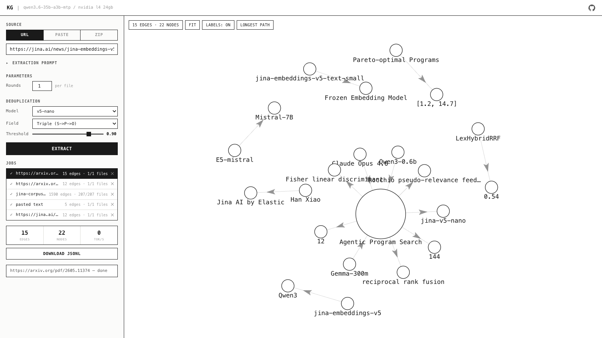

# Knowledge Graph Extractor — Qwen3.6-35B-A3B-MTP on a single L4

Turn any document (or a whole zip of them) into an interactive knowledge graph,
using a self-hosted LLM on a single NVIDIA L4 24GB GPU.

**Live demo: https://hanxiao.io/knowledge-graph**

[](https://hanxiao.io/knowledge-graph)

Each extracted fact is one graph edge: a `(subject) --[predicate]--> (object)`
triple plus a self-contained title, description, verbatim evidence span,
confidence, tags, and the source file it came from. Facts stream into a live
force-directed graph; hover any edge to see the full fact card.

## What it does

1. **Input** — paste text, give a URL (fetched to markdown via Jina Reader), or
   upload a `.zip` of documents (txt, md, html, pdf, docx, json, csv, code...).
2. **Extract** — the LLM emits 0-15 atomic relationship facts per round, with a
   graph-fit prompt that forces canonical entity/value `subject`/`object` so
   nodes actually connect instead of becoming prose dead-ends.
3. **Dedup** (optional, on by default) — real-time semantic dedup via
   [jina-embeddings-v5-text-nano](https://huggingface.co/jinaai/jina-embeddings-v5-text-nano)
   on CPU removes duplicate facts across rounds *and across files* in a zip.
4. **Visualize** — every unique fact becomes one edge in a force-directed graph
   (node names normalized by lowercase/trim so variants merge). Hover for the
   card. Download the full result as JSONL for downstream graph building.

## Job queue (multi-user)

The L4 has one llama slot, so requests are serialized by a single-slot scheduler
(modeled on [searchbox](https://github.com/hanxiao/searchbox)):

- **One job at a time.** Others queue and wait.
- **Preemption.** A new submission preempts the running job; the preempted job is
  persisted and returns to a backfill pool.
- **Auto-backfill.** When the slot idles, the oldest paused job resumes from
  exactly where it left off (already-done files skipped, dedup vectors rebuilt
  from the persisted JSONL).
- **Persistence.** Every job (meta + facts.jsonl + input) lives under `data/jobs/`
  (mounted as a Docker volume), so the job list, JSONL reload, and resume all
  survive restarts and container rebuilds.
- **Job panel.** See all requests, reload any past job's JSONL into the graph,
  and pause / resume / delete per job.

## Stack

| Component | What | Port |
|-----------|------|------|
| **llama-server** | [llama.cpp](https://github.com/ggml-org/llama.cpp) with CUDA, serves Qwen3.6-35B-A3B via an OpenAI-compatible API | 8080 |
| **app** | FastAPI app: extraction + job scheduler + jina-v5-nano dedup (CPU) + UI | 3000 |

## Hardware

Single NVIDIA L4 24GB GPU (e.g. GCP `g2-standard-8`). The model runs in
**Q3_K_XL** quantization with MTP (Multi-Token Prediction) speculative decoding —
benchmarked at ~76 tok/s decode, +34% over Q4_K_XL with no quality loss on this
task (see [`autoresearch/`](autoresearch/REPORT.md)).

## Quick start

```bash
git clone https://github.com/hanxiao/knowledge-graph-extractor.git
cd knowledge-graph-extractor

# Jina API key (free at https://jina.ai/api-key, used for URL-to-markdown)
cp .env.example .env
# edit .env and add your JINA_API_KEY

# On a fresh GCP L4 instance, one-shot setup:
bash scripts/setup.sh
```

This downloads the model (~17GB), pulls Docker images, and starts both services.
Once running, open `http://<your-ip>:3000`.

## Manual setup

If you already have Docker + the NVIDIA Container Toolkit:

```bash
# Download model (~17GB) via the Python API (the hf console script is often
# not on PATH after a pip --user install).
mkdir -p models
pip install -q huggingface-hub
python3 -c "from huggingface_hub import hf_hub_download; \
hf_hub_download('unsloth/Qwen3.6-35B-A3B-MTP-GGUF', \
'Qwen3.6-35B-A3B-UD-Q3_K_XL.gguf', local_dir='models')"

docker compose up -d --build
```

## Configuration

### llama-server flags (`docker-compose.yml`)

| Flag | Value | Why |
|------|-------|-----|
| `--ctx-size` | 16384 | Balance input capacity vs VRAM |
| `-fitt` | 512 | Auto-fit threshold, prevents OOM with MTP |
| `--spec-type draft-mtp` | — | MTP speculative decoding — load-bearing on L4 (+39% at Q3; removing it drops 76→54 tok/s) |
| `--spec-draft-n-max` | 3 | Draft 3 tokens per step (best on L4) |
| `--spec-draft-p-min` | 0.1 | Draft only reasonably-confident positions |
| `--cache-reuse` | 256 | KV cache reuse across rounds (40x prefill speedup on same doc) |
| `--flash-attn` | 1 | Flash attention |
| `--no-mmap` | — | Required when auto-fit offloads tensors to CPU |
| `--n-predict` | 8192 | Max generation length |

### Extraction parameters (UI)

| Parameter | Default | What |
|-----------|---------|------|
| Rounds | 1 | Extraction passes per document (more seeds = more coverage) |
| Dedup model | jina-v5-nano | On by default, runs on CPU |
| Dedup field | Triple (S+P+O) | What to embed for similarity |
| Dedup threshold | 0.90 | Cosine similarity cutoff |

## Throughput findings (benchmarked)

Full methodology, per-experiment logs, and 5-repeat confirmations are in
[`autoresearch/`](autoresearch/REPORT.md). Highlights:

- **Q3_K_XL over Q4_K_XL**: +34% decode, no measurable quality loss on this task.
  Decode is bandwidth-bound, so fewer bits/weight ≈ proportionally faster.
  ~3.5bpw is the quality floor — lower (i-quants, Q2) loses or fabricates facts.
- **MTP n=3** + **`--spec-draft-p-min 0.1`** is the decode peak; n≥4 is slower.
  MTP is essential here (+39% at Q3) — the opposite of fast consumer GPUs where
  spec-decode is net-negative for this MoE; on the bandwidth-starved L4 its
  forward-pass amortization wins.
- **nothink mode** required: thinking wastes ctx on reasoning tokens.
- **JSON schema constraint**: ~0 decode overhead, guarantees valid output.
- **KV cache reuse**: 40x prefill speedup on same-document subsequent rounds.
- **Did NOT help** (measured): KV quant, smaller ctx, MXFP4 (inert); `--parallel`
  concurrent rounds, mixed-precision KV (harmful); n-gram drafting (loses to MTP).

## Cost

| Mode | $/hr | $/month |
|------|------|---------|
| GCP L4 standard | ~$0.86 | ~$620 |
| GCP L4 spot | ~$0.26 | ~$190 |

## File structure

```
├── app.py                  # FastAPI app: extraction + UI + API
├── jobs.py                 # single-slot job scheduler (queue/preempt/backfill/persist)
├── Dockerfile              # app container
├── docker-compose.yml      # both services + data volume
├── .env.example            # environment variables template
├── jina-corpus.zip         # bundled default zip dataset (Jina blog articles)
├── templates/
│   └── chat_template.jinja # Qwen3.6 chat template (nothink mode)
├── scripts/
│   └── setup.sh            # one-shot GCP L4 setup
├── autoresearch/           # throughput optimization dataroom (harness, experiments, REPORT.md)
├── data/                   # persisted jobs (gitignored, Docker volume)
└── models/                 # model files (gitignored, ~17GB)
```

## License

MIT
